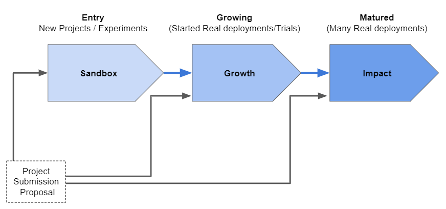
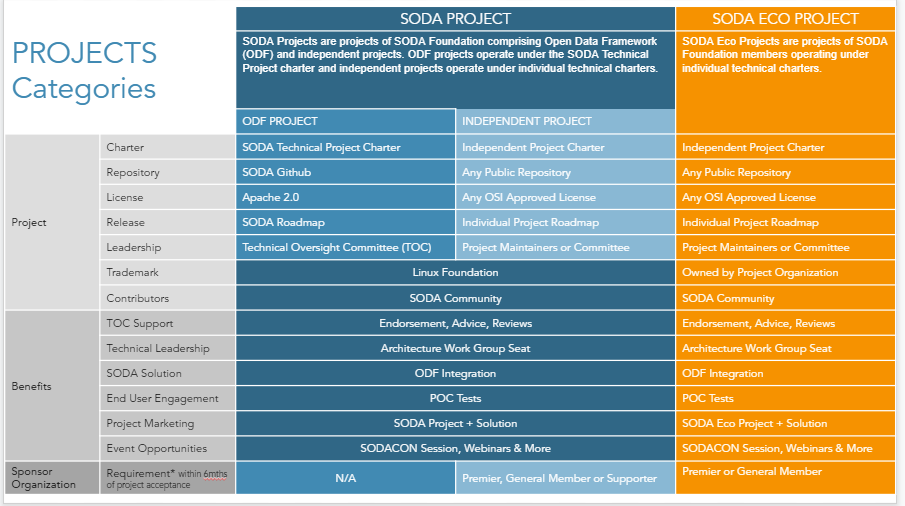
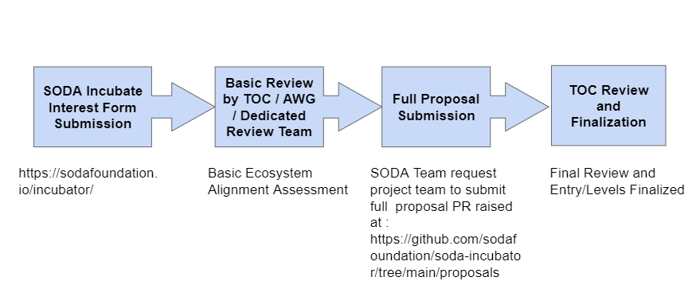

# SODA Incubator Policy

SODA Foundation hosts various open source projects for data and storage under its project landscape. Individuals or organizations can submit their open source projects to be part of the SODA Project landscape which will provide additional ecosystem and technical benefits from SODA Foundation in terms of users, branding, community developers and technology guidance. It provides the opportunity to be part of the foundation and build data and storage solutions for end users based Open Data Framework (ODF) from SODA Foundation.

## Overview
 
This SODA Project Incubator policy describes how an open source project can formally join the Foundation via the SODA Incubator Program. It describes the 3 stages (Sandbox, Growth, Impact) a project may be admitted under and what the criteria, expectations are for a given stage, and the acceptance criteria for a project to move from one stage to another. It also describes the Annual Review Process through which those changes will be evaluated and made.
 
Project progression - movement from one stage to another - allows projects to participate at the level that is most appropriate for them given where they are in their lifecycle. Regardless of stage, all SODA Foundation projects benefit from a deepened alignment with existing projects, and access to mentorship, support, and foundation resources. Based on the levels, the project can get better visibility, credibility and usage in the industry.

## Project Stages and Progression View

There are 3 stages for all the incoming projects to SODA Foundation, viz., Sandbox, Growth and Impact. This is based on the development and usage maturity level of the projects.

Please see the different stage and progression view in the below picture.

The projects can be applied for any of the 3 stages based on the current level of maturity of the project.

 ## Project Categories

SODA Projects are mainly categorized into 2 :  SODA Projects and SODA ECO Projects. SODA Project can be - ODF Project (Open Data Fraemwork Project) which is developed and maintained directly by SODA Foundation OR Independent Project which is developed by any other individuals or organizations.

Please find the detailed attributes of SODA Projects and SODA ECO projects in the below picture:

Both SODA Projects and SODA ECO Projects are eligible to go through the SODA Incubator Stages (Sandbox, Growth and Impact)

## Overall Project Proposal Process
Please find the project submission and approval process below:

Please note that TOC can decide to update the overall process of review to improve the assessment and acceptance criteria. It will be communicated/updated in the policy from time to time. TOC decision is the final in the overall review process.

### Project Proposal Requirements
Projects must be formally proposed via the SODA Project Proposal as mentioned in the above process as a new PR under https://github.com/sodafoundation/soda-incubator/tree/main/proposals . There is a suggestive template provided at https://github.com/sodafoundation/soda-incubator/blob/main/governance/SODAProjectIncubationProposal_Template.pdf 

Project proposals submitted to the SODA Foundation should provide the following information to the best of their ability:
 
* name of project
* project description (what it does, why it is valuable, origin and history)
* statement on alignment with Foundation charter's mission
* link to *current* Code of Conduct (if one is adopted already)
* sponsor from TOC, if identified (a sponsor helps mentor projects)
* project license
* source control (GitHub by default)
* issue tracker (GitHub by default)
* external dependencies (including licenses)
* release methodology and mechanics
* names of initial committers, if different from those submitting proposal
* briefly describe the project's leadership team and decision-making process
* link to any documented governance practices
* preferred maturity level (see stages below)
* list of project's official communication channels (slack, irc, mailing lists)
* link to project's website
* links to social media accounts
* existing financial sponsorship
* infrastructure needs or requests
 
### Project Acceptance Process
* Projects are required to present their proposal at a TOC meeting
* The TOC may ask for changes to bring the project into better alignment with the SODA Foundation (adding a governance document to a repository or adopting a Code of Conduct, for example).
 * The project will need to make these changes in order to progress further.
* Projects are accepted via a 2/3 supermajority vote of the TOC.
* The TOC will determine the appropriate initial stage for the project based on the review. The project can apply for a different stage via the review process. (The applicant can mention the desired stage in which the project is applied for)
* TOC Decision is final.
 
## Post Acceptance Expectations

### SODA Projects

Once accepted formally to incubate as SODA Incubator Project, the project needs follow the attributes as per the Project Categories section above. Also the project needs to provide the github ownership access to Linux Foundation and SODA Foundation github ids.
( “thelinuxfoundation” and “thesodafoundation”)

Project will be listed as SODA Project under SODA Social channels along with the project logo and / links and other information. It will also be added to the SODA Project landscape. The project github should be marked with “It is a SODA Project”

### SODA ECO Projects
Once accepted formally to incubate as SODA Incubator Project, the project needs follow the attributes as per the Project Categories section above. The trademark and github project ownership can be with the organization itself.

Project will be listed as SODA Project under SODA Social channels along with the project logo and / links and other information. It will also be added to the SODA Project landscape. The project github should be marked with “It is a SODAECO Project”

 
## Stages : Definitions & Basic Expectations

### Sandbox Stage
**Definition**
 
Sandbox projects are projects which the TOC believes are, or have the potential to be, important to the ecosystem of ImpactProjects or the data and storage ecosystem as a whole. They may be early-stage projects just getting started, or they may be long-established projects with minimal resource needs. The Sandbox stage provides a beneficial, neutral home for these projects in order to foster collaborative development and provide a path to deeper alignment with other Foundation projects via the graduation process.
 
**Examples**
 
* New projects that are designed to extend one or more Foundation projects with functionality or interoperability libraries.
* Independent projects that fit within the Foundation mission and provide potential for a novel approach to existing functional areas (or are an attempt to meet an unfulfilled need).
* Projects commissioned or sanctioned by the Foundation
* Any project that realistically intends to join the Foundation Growth or Impact Stages in the future and wishes to lay the foundations for that transition. 

 
**Expectations**
 
End users should evaluate Sandbox projects with care, as this stage does not set requirements for community size, governance, or production readiness. Sandbox projects will receive minimal support from the Foundation. Projects will be reviewed on an annual basis; they may also request a status review by submitting a report to the TOC.
 
**Acceptance Criteria**
 
To be considered for the Sandbox Stage, the project must meet the following requirements:
* 1 TOC sponsors to champion the project & provide mentorship as needed
* A presentation at the meeting of the TOC
* Adherence to the SODA Foundation's IP Policy
* Upon acceptance, Sandbox projects must list their status prominently on their website/README
 
### Growth Stage
**Definition**
 
The Growth Stage is for projects that are interested in reaching the Impact Stage, and have identified a growth plan for doing so. Growth Stage projects will receive mentorship from the TOC and are expected to actively develop their community of contributors, governance, project documentation, and other variables identified in the growth plan that factor in to broad success and adoption.
 
In order to support their active development, projects in the Growth stage have a higher level of access to foundation resources, which will be agreed upon and reviewed on a yearly basis. A project's progress toward its growth plan goals will be reviewed on a yearly basis, and the TOC may ask the project to move to the Sandbox stage if progress on the plan drops off or stalls.
 
**Examples**
 
* Projects that are on their way or very likely to become Impact Projects.
* Projects that have developed new growth targets or other community metrics for success.
* Projects that are looking to create a lifecycle plan (maintainership succession, contributor programs, version planning, etc.)
* Projects that need more active support from the Foundation or TOC mentorship in order to reach their goals.
 
**Expectations**
 
Projects in the Growth Stage are generally expected to move out of the Growth stage within two years. Depending on their growth plans, projects may cycle through Sandbox, Growth, or Impact stage as needed. 
 
**Acceptance Criteria**
 
To be considered for Growth Stage, the project must meet the Sandbox requirements as well as the following:
 
 * Development of a growth plan, to be done in conjunction with their project mentor(s) at the TOC.
 * Document that it is being used successfully in production by at least two independent end users which, in the TOC judgement, are of adequate quality and scope.
 * Demonstrate a substantial ongoing flow of commits and merged contributions.
 * Demonstrate that the current level of community participation is sufficient to meet the goals outlined in the growth plan.
 * Since these metrics can vary significantly depending on the type, scope and size of a project, the TOC has final judgement over the level of activity that is adequate to meet these criteria.
 * Receive a two-thirds supermajority vote of the TOC to move to Growth Stage.
 
### Impact Stage
**Definition**
 
The Impact Stage is for projects that have reached their growth goals and are now on a sustaining cycle of development, maintenance, and long-term support. Impact Stage projects are used commonly in enterprise production environments and have large, well-established project communities.    
 
**Examples**
 
* Projects that have publicly documented release cycles and plans for Long Term Support ("LTS").
* Projects that have themselves become platforms for other projects.
* Projects that are able to attract a healthy number of committers on the basis of its production usefulness (not simply 'developer popularity').
* Projects that have several, high-profile or well-known end-user implementations.
 
**Expectations**
 
Impact Stage projects are expected to participate actively in TOC proceedings, and as such have a binding vote on TOC matters requiring a formal vote, such as the election of a TOC representative. They receive ongoing financial and marketing support from the Foundation, and are expected to cross promote the foundation along with their activities.
 
**Acceptance Criteria**
 
To graduate from Sandbox or Growth status, or for a new project to join as an Impact project, a project must meet the Growth stage criteria plus:
 
 * Have a defined governing body of at least 5 or more members (owners and core maintainers), of which no more than 1/3 is affiliated with the same employer. In the case there are 5 governing members, 2 may be from the same employer.
 * Have a documented and publicly accessible description of the project's governance, decision-making, and release processes.
 * Have a healthy number of committers from at least two organizations. A committer is defined as someone with the commit bit; i.e., someone who can accept contributions to some or all of the project.
 * Adopt the SODA Foundation's Code of Conduct.
 * Explicitly define a project governance and committer process. This is preferably laid out in a GOVERNANCE.md file and references a CONTRIBUTING.md and OWNERS.md file showing the current and emeritus committers.
 * Have a public list of project adopters for at least the primary repo (e.g., ADOPTERS.md or logos on the project website).
 * Other metrics as defined by the applying Project during the application process in cooperation with the TOC.
 * Receive a supermajority vote from the TOC to move to Impact stage. Projects can move directly from Sandbox to Impact, if they can demonstrate sufficient maturity and have met all requirements.
 
### Emeritus Stage
**Definition**
 
Emeritus projects are projects which the maintainers feel have reached or are nearing end-of-life. Emeritus projects have contributed to the ecosystem, but are not necessarily recommended for modern development as there may be more actively maintained choices. The Foundation appreciates the contributions of these projects and their communities, and the role they have played in moving the ecosystem forward.
 
**Examples**
 
* Projects that are "complete" by the maintainers' standards.
* Projects that do not plan to release major versions in the future.
 
**Expectations**
 
Projects in this stage are not in active development. Their maintainers may infrequently monitor their repositories, and may only push updates to address security issues, if at all. Emeritus projects should clearly state their status and what any user or contributor should expect in terms of response or support. If there is an alternative project the maintainers recommend, it should be listed as well. The foundation will continue to hold the IP and any trademarks and domains, but the project does not draw on foundation resources.
 
**Acceptance Criteria**
 
Projects may be granted Emeritus status via a 2/3 vote from the TOC and with approval from project ownership. In cases where there is a lack of project ownership, only a 2/3 vote from the TOC is required.

There is no direct application for Emeritus Stage.  
 
## Annual Review Process
 
The TOC shall develop an annual review process to determine whether projects are in the stage that accurately reflects their needs and goals.
 
### Annual Review Expectations

Project Annual Review proposals to be submitted under : https://github.com/sodafoundation/soda-incubator/blob/main/proposals with the following information. (You can add more information to substantiate if you are applying of level upgrade in the annual review)
 
* name of project
* project description (what it does, why it is valuable, origin and history)
* statement on alignment with Foundation charter's mission
* link to *current* Code of Conduct (if one is adopted already)
* sponsor from TOC, if identified (a sponsor helps mentor projects)
* project license
* source control (GitHub by default)
* Annual Growth and Progress Impact
** Last Year overall progress summary
** Growth in community, users and technical features
** Releases, Code / PR rate, Issue handling updates
** Impact done for SODA Ecosystem
* Stage applied for in the current review cycle (If upgrade, please add all the needed data for the respective stage)

Any more information, please email to info@sodafoundation.io

To Submit your project for incubation, please apply the interest at https://sodafoundation.io/incubator/
